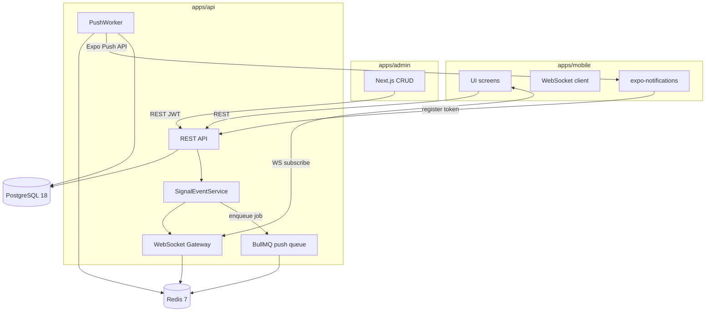
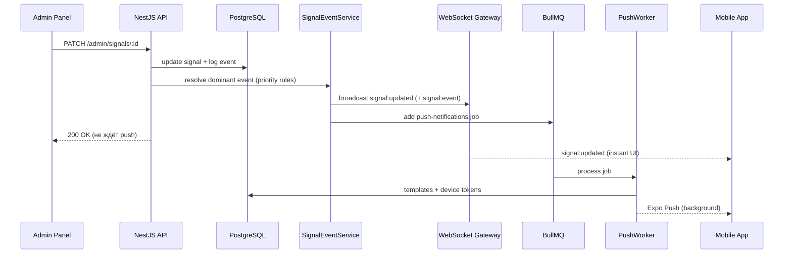

# QPulse Architecture

Monorepo: **Expo SDK 55** (mobile) + **NestJS 11** (API) + **Next.js 16** (admin). Данные — только **PostgreSQL 18**. Realtime — **WebSocket + Redis pub/sub**. Push — **BullMQ + Expo Push API**.

## High-level diagram



## Monorepo structure

```
QPulse/
├── apps/
│   ├── mobile/          # Expo SDK 55 — UI + WS + push
│   ├── api/             # NestJS — REST + WS + BullMQ
│   └── admin/           # Next.js 16 — CRUD
├── packages/
│   └── shared/          # DTOs, enums, WS payloads (source of truth)
├── docs/                # Architecture, contracts, runbooks
├── AGENTS.md
├── tasks.md
├── .cursor/rules/
├── docker-compose.yml   # PostgreSQL 18 + Redis 7
└── turbo.json
```

**Инструменты:** pnpm workspaces + Turborepo. Node **24.16.0** LTS (`.nvmrc`).

## Data flow: admin update → mobile



## Redis — две роли

| Роль | Назначение |
|------|------------|
| **BullMQ backend** | Очередь `push-notifications`, retry jobs |
| **Pub/sub** (`qpulse:ws`) | Broadcast WebSocket между несколькими инстансами API |

Без Redis pub/sub при horizontal scaling часть клиентов не получит WS update.

## Signal lifecycle

| Status | Mobile | Описание |
|--------|--------|----------|
| `OPEN` | Spots/Futures (live) | Ордера выставлены |
| `ACTIVE` | Spots/Futures (live) | Позиции активны |
| `CLOSED` | Results only | Закрыта; требует `closeDate` |
| `CANCELLED` | Скрыт | Только админка |

**`liquidated`:** boolean, только при `status=CLOSED`. При `liquidated=true` backend принудительно `slHit=false`.

## Results model

- **Summary** — готовые значения из `ResultsSummary` (ключ `marketType + timeframe`). MVP: админ редактирует вручную.
- **Список** — `Signal WHERE status=CLOSED`, фильтр по `marketType` + rolling window `closeDate` (timeframe 1W–1Y).

Timeframe — **контекст Results**, не поле Signal.

## NestJS API modules

```
apps/api/src/
├── signals/           # CRUD (admin) + public read + event emit
├── results/           # ResultsSummary + closed signals by closeDate
├── home-content/      # BTC stats, ticker, social links
├── settings/          # menu links + disclaimer, telegramFabUrl
├── reviews/           # POST review + admin moderation
├── devices/           # push token register/unregister
├── auth/              # JWT admin auth
├── realtime/          # WebSocket Gateway + Redis pub/sub
├── queue/             # BullMQ module
├── notifications/     # PushWorker + admin templates/log
└── events/            # SignalEventService — diff → WS + BullMQ
```

## Deployment (Railway)

| Service | Описание |
|---------|----------|
| `apps/api` | Web service, Dockerfile |
| `apps/admin` | Next.js standalone |
| PostgreSQL 18 | Railway plugin |
| Redis 7 | Railway plugin |

Подробности: [runbooks/deploy-railway.md](runbooks/deploy-railway.md).

## Backlog (не в текущей итерации)

- Charts tab
- ExternalSignalsAdapter
- Auto-sync ResultsSummary при закрытии сигнала
- Multi-admin / RBAC
- BullMQ dead letter queue
- E2E API tests
